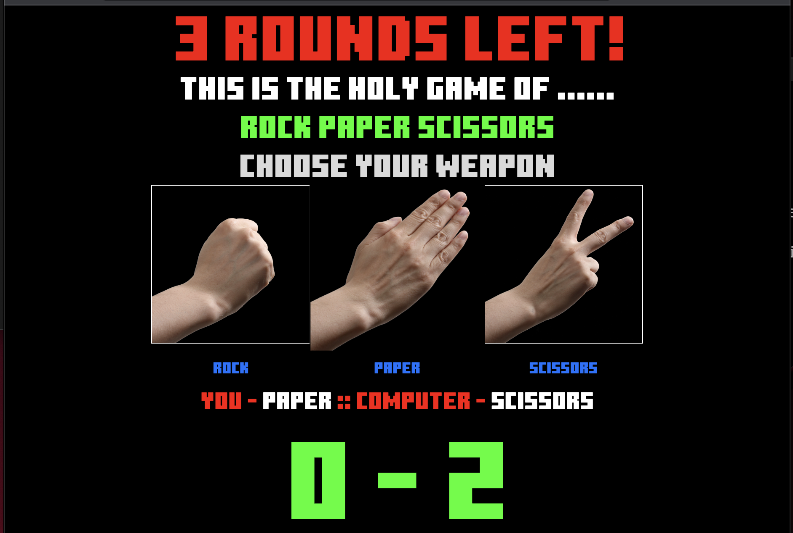

# Rock-Paper-Scissors Game 🎮

## What I Learned 🧠

Throughout the development of this Rock-Paper-Scissors game project, I gained a wealth of knowledge and practical experience, including:

1. **DOM Manipulation** 🖥️: I acquired a deep understanding of Document Object Model (DOM) manipulation, enabling me to interact with and modify web page elements dynamically.

2. **Element Retrieval** 📜: I learned how to efficiently retrieve and manipulate HTML elements from the web page using JavaScript, allowing me to create interactive and responsive features.

3. **Dynamic Font Sizing** 📏: I mastered the art of dynamically adjusting font sizes using viewport units (vw and vh). This skill enhanced the visual appeal and responsiveness of the game across various screen sizes.

4. **Keyframe Animations** 🎆: I delved into the world of keyframe animations in CSS, enabling me to create eye-catching animations and transitions that added a level of engagement and excitement to the user experience.

5. **CSS-in-JS** 🎨: I explored the technique of writing CSS within JavaScript for HTML elements, giving me greater control and flexibility in styling and theming the game's components.

6. **Original JavaScript Logic** 🚀: One of the most valuable takeaways from this project is the ability to create the entire game logic from scratch in JavaScript. Every aspect, from user interactions to determining the game's outcome, was designed and implemented by me, demonstrating my capability to independently develop complex software systems.

This project has not only honed my front-end development skills but has also instilled in me a deep appreciation for the creativity and problem-solving that goes into crafting an engaging web-based application.

By creating this Rock-Paper-Scissors game from the ground up, I've expanded my expertise and confirmed my proficiency in web development. This experience has been instrumental in my journey to becoming a proficient developer in the world of interactive web applications.

## Table of Contents 📜
- [Description](#description)
- [Demo](#demo)
- [HTML Structure](#html-structure)
- [CSS Styling](#css-styling)
- [JavaScript Functionality](#javascript-functionality)
- [License](#license)
- [Author](#author)

## Description 📝
This is a web-based Rock-Paper-Scissors game that provides an interactive and visually appealing experience. It allows users to play the classic hand game against the computer. The game includes animation and dynamic messaging to enhance user engagement.

## Demo 🚀
You can access the live demo of this Rock-Paper-Scissors game by following this link: [Rock-Paper-Scissors Demo](https://musaddique333.github.io/rock-paper-scissors/)

## HTML Structure 🏗️
The HTML structure defines the layout and components of the game. It includes the following elements:
- A header displaying game messages.
- Main game content with instructions.
- Images for the Rock, Paper, and Scissors options.
- A score board to track the user's and computer's scores.
- A game-over screen with a "Try Again" button.

## CSS Styling 🎨
The CSS styles used for this game provide a visually appealing and animated experience. Key styling features include:
- Background color, font, and text color settings.
- Animations for text elements, buttons, and images.
- Responsiveness and layout adjustments.
- Styling of the game-over screen and buttons.

## JavaScript Functionality 🚀
The JavaScript code handles the game's functionality, including:
- Keeping track of player and computer scores.
- Managing game rounds and rounds won by the player and computer.
- Displaying game messages, including countdowns and game-over messages.
- Handling user input and game logic for Rock, Paper, and Scissors selections.
- Triggering animations and transitions for an engaging user experience.

## License 📜
This project is licensed under the MIT License. See the [LICENSE](LICENSE) file for details.

## Author 👨‍💻
- Author: musaddique333 

---

Enjoy playing Rock-Paper-Scissors! If you have any questions or feedback, please don't hesitate to reach out. 😄
